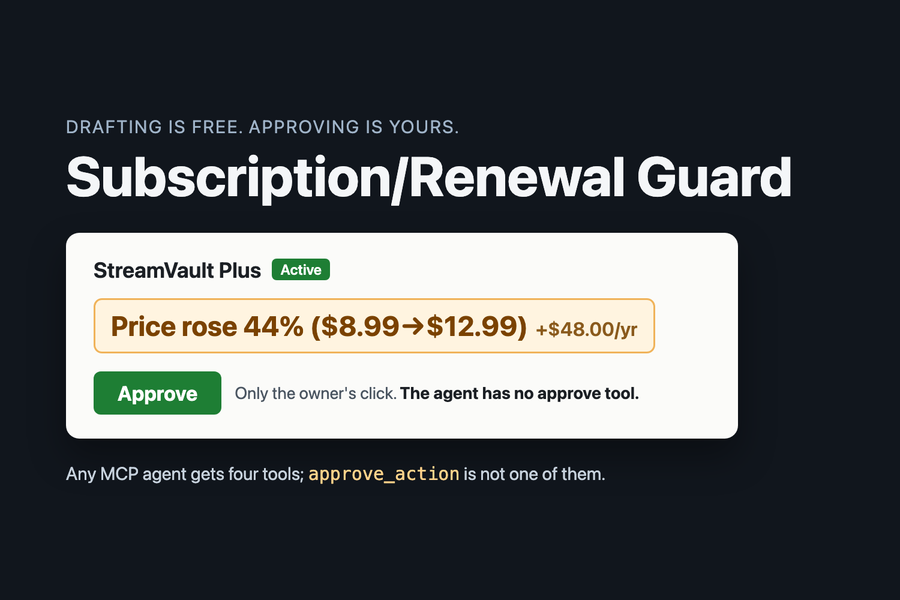
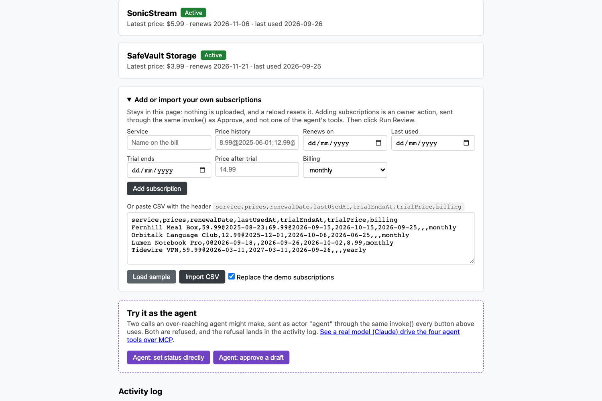
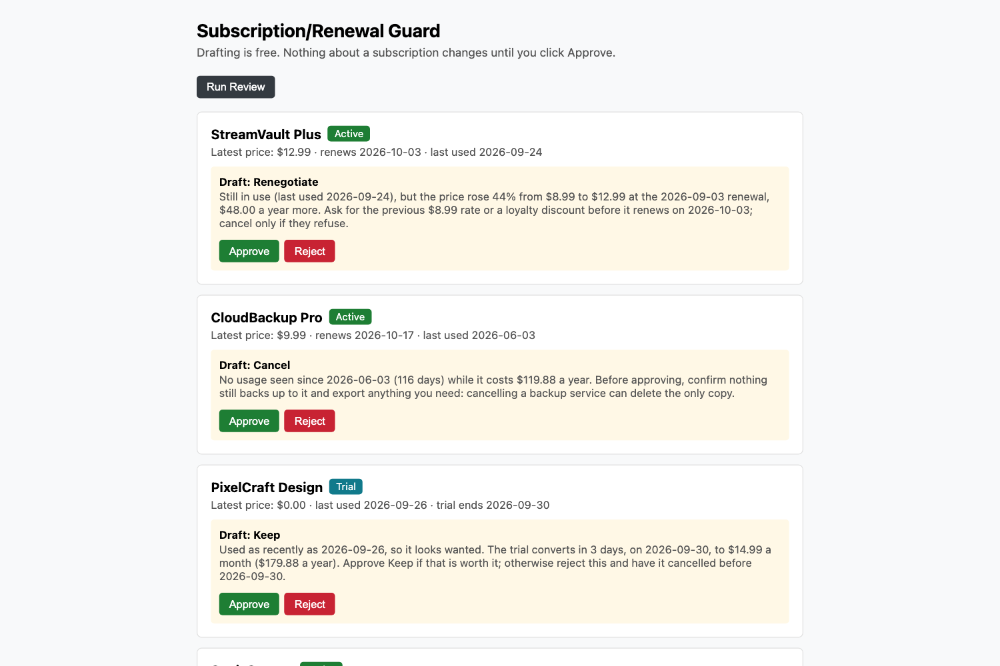
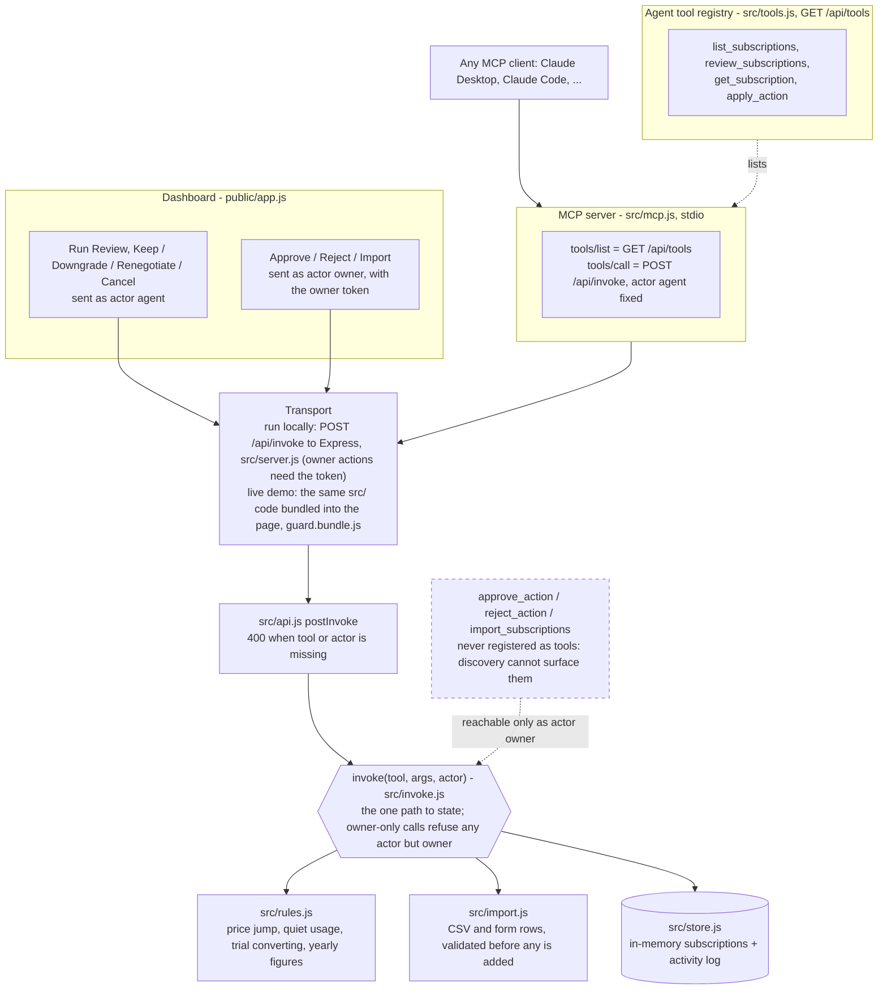

# Subscription/Renewal Guard



A price hike that lands quietly costs money, and a cancellation that fires on the wrong
subscription can cost a whole account. Subscription/Renewal Guard checks a household's or
small business's subscriptions for three warning signs: a price rise since the last
renewal, no usage for a long time, and a free trial about to become a paid plan. For each
subscription that trips a threshold, it drafts one action with the evidence behind it and
what it is worth a year. The draft is only a draft. `apply_action` can write a draft but
never a `status`. Only `approve_action` can change a subscription's real state, and it is
never registered as a tool an agent can call. It runs only from the owner's Approve click
on the dashboard.

**How this differs from agents that ask first.** Rocket Money's Rowan, announced on 25 Aug
2026, texts a member before a trial turns paid, and cancels it when the member replies
"cancel" ([press release](https://www.prnewswire.com/news-releases/rocket-moneys-rowan-rewrites-what-ai-can-do-in-personal-finance-302859522.html)).
There, the go-ahead is a reply in the same conversation the agent reads. Here the approval
is not something the agent can be told: `approve_action` is not in the agent's tool list
at all, so no misread reply and no injected instruction can approve anything. It is also
local-first, which is the OFFGRID half of the idea: no bank login, no account, no
aggregator. The live demo runs entirely in your browser, and run locally everything stays
on 127.0.0.1.

**Why it matters.** In a 2022 C+R Research survey of 1,000 consumers, 42% said they had
stopped using a subscription but forgot they were still paying for it, and people who
estimated their subscription spend at $86 a month were spending $219 once it was itemized
([C+R Research](https://www.crresearch.com/blog/subscription-service-statistics-and-costs/)).

**Is there a model in it?** No model is bundled. The agent's side is a four-tool registry
that any tool-calling model can drive, served over the Model Context Protocol by
`node src/mcp.js`. [`docs/mcp-transcript.md`](docs/mcp-transcript.md) is a recorded session
with Claude (Anthropic) in that seat, run in Claude Code, the same AI coding agent that
wrote this code. It reviewed the subscriptions and drafted three actions in its own words.
Then, having just seen that `approve_action` is not in its tool list, it called it anyway,
on purpose, to record what an agent gets when it tries: a refusal. On the dashboard, Run
Review and the draft buttons make the same calls as actor `agent`.

**Try it live:** https://guptachetan1995.github.io/hack47-offgrid/ (runs entirely in your
browser on fictional data, or on subscriptions you paste in; nothing is sent anywhere,
reload to reset)

**Demo video (2:10):** https://youtu.be/hkDpW_DNd00

**Source:** https://github.com/guptachetan1995/hack47-offgrid

Built for [HACK47: OFFGRID](https://hack47-offgrid.devpost.com/), which has an open brief:
no fixed theme and no required stack.

## What it does

`review_subscriptions` checks every subscription that is still `active` or on `trial`
against three rules (`src/rules.js`). Each rule has its own threshold, so the evidence in
a draft always traces back to one named rule:

| Rule | Fires when | Evidence it produces |
|---|---|---|
| Price jump | The latest price is more than 15% above the one before it | `Price rose 44% ($8.99→$12.99) at the 2026-09-03 renewal (+$48.00/yr).` |
| Usage gone quiet | An `active` subscription has not been used in 60+ days | `No usage seen since 2026-06-03 (116 days); it costs $119.88/yr.` |
| Trial converting | A `trial` converts to paid within 7 days | `Trial converts to paid on 2026-09-30 (3 days away), then $179.88/yr.` |

Each finding says what it is worth a year: the price rise, the whole price of a quiet
subscription, or the price a trial converts to. Prices count as monthly unless a
subscription is marked `yearly`, and a trial with no known price after it gets no figure.
A subscription that trips two rules is one charge, so its figure is the larger one, not
the sum. After a review the dashboard shows two totals: **At stake in open flags** and
**Decided by you**.

For a flagged subscription, `apply_action` drafts one of four actions: **keep**,
**downgrade**, **renegotiate** or **cancel**. The draft's note must quote a figure that
one of that subscription's fired rules actually produced (a price, the percentage, the
last-used date, the quiet day count, the trial end date or the days left), as a whole
token. So `cancel this` and `cancel this trial` are refused, and `13 days` does not count
as citing `3 days`. Subscriptions that trip nothing get nothing back, so no work is
invented for them.

Turning a draft into a real status is owner-only:

| Draft | Owner clicks Approve | Owner clicks Reject |
|---|---|---|
| `keep` | status → `active`, and the finding is acknowledged | draft cleared, status unchanged |
| `downgrade` | status → `downgraded` | draft cleared, status unchanged |
| `renegotiate` | status → `renegotiation_sent` | draft cleared, status unchanged |
| `cancel` | status → `cancelled` | draft cleared, status unchanged |

An approved **keep** sticks: the next review stays quiet about the finding the owner
accepted (step 8 of the walkthrough below shows it). A new price change, a new quiet
stretch or a new trial date is a different finding, so it flags again. After an approved downgrade, renegotiate or cancel, the
subscription is no longer `active` or `trial`, so review skips it and `apply_action`
refuses to draft for it again. A reject is not a decision about the subscription, so its
flag stays open.

The seed dates in `fake-data/seed-subscriptions.json` are stored as offsets from today, so
the demo stays correct whenever you run it. The dates in the evidence above come from the
recorded MCP session on 2026-09-28. Yours will be different.

## Bring your own subscriptions

Open **Add or import your own subscriptions** on the dashboard. Add one subscription with
the form, or paste a CSV and click **Import CSV**. **Load sample** fills the box with four
fictional subscriptions dated relative to today, three of which trip a rule. Tick
**Replace the demo subscriptions** to review only your own. Then click **Run Review**.

On the live demo the CSV is parsed and checked in your browser and never leaves the page.
Run locally, it goes only to the server on 127.0.0.1. Either way, importing is an owner
action: it goes through the same `invoke()` as Approve, as actor `owner`, and it is not
one of the agent's tools, so an agent cannot plant a subscription for itself to "find".
Every row is validated before any is added, so a bad row refuses the whole import. So does
a header that names a column twice.

| Column | Required | Format |
|---|---|---|
| `service` | yes | The name on the bill |
| `prices` | yes | Price history, `amount@YYYY-MM-DD` separated by `;`, e.g. `8.99@2025-06-01;12.99@2026-09-01` |
| `renewalDate` | no | `YYYY-MM-DD` |
| `lastUsedAt` | no | `YYYY-MM-DD` |
| `trialEndsAt` | no | `YYYY-MM-DD`, today or later. A row with this date is a trial; a trial that has already ended is refused, since it is a paid plan now |
| `trialPrice` | no | What the trial converts to, e.g. `14.99` |
| `billing` | no | `monthly` (the default) or `yearly` |

```csv
service,prices,renewalDate,lastUsedAt,trialEndsAt,trialPrice,billing
Fernhill Meal Box,59.99@2025-08-23;69.99@2026-09-15,2026-10-15,2026-09-25,,,monthly
```



## A real model in the agent seat (MCP)

`src/mcp.js` is a stdio MCP server that gives any tool-calling model the agent's seat. It
is a thin front on the running dashboard server, not a second copy of the app:

- `tools/list` returns `GET /api/tools`, exactly the four tools in `src/tools.js`.
- `tools/call` sends `POST /api/invoke` with `actor: "agent"` fixed in `src/mcp.js`. An
  `actor` or `status` in the arguments changes nothing.
- The model's drafts land in the same store the owner is watching, and the dashboard polls
  so they appear on their own, waiting for Approve.
- Asking for `approve_action`, `reject_action` or `import_subscriptions` gets JSON-RPC
  error `-32602`: *"Unknown tool: approve_action. This server has exactly these tools:
  list_subscriptions, review_subscriptions, get_subscription, apply_action. Approving,
  rejecting or importing is an owner-only action on the dashboard; no tool here can do
  it."* The call never reaches `invoke()`.

Start the dashboard with `npm start`, then point an MCP client at `src/mcp.js`. This is the
usual stdio server entry for Claude Desktop's `claude_desktop_config.json` or a project's
`.mcp.json` (set `GUARD_URL` if the dashboard is not on port 3100). It has not been tried
with either app here; the recorded session below used its own small client:

```json
{
  "mcpServers": {
    "subscription-guard": {
      "command": "node",
      "args": ["/absolute/path/to/hack47-offgrid/src/mcp.js"],
      "env": { "GUARD_URL": "http://127.0.0.1:3100" }
    }
  }
}
```

**The recorded session.** [`docs/mcp-transcript.md`](docs/mcp-transcript.md) is Claude
(Anthropic), working in Claude Code on 2026-09-28, driving `src/mcp.js` over stdio. Claude
Code is also what wrote this code, so the session is the builder trying the finished tool
from the agent's seat: a demonstration, not an independent test. Claude Code runs one
shell command at a time and can't hold a stdio pipe open between them, so `scripts/mcp-relay.js` kept the pipe open: Claude posted each JSON-RPC message to
it, and it wrote those bytes to the server and recorded every line both ways in
[`docs/mcp-transcript.jsonl`](docs/mcp-transcript.jsonl). The Markdown page is generated
from that log, and `tests/transcript.test.js` checks it still matches byte for byte. In
the session, Claude:

1. listed the four tools and ran `review_subscriptions` (three flagged);
2. read two records with `get_subscription` before deciding;
3. drafted **renegotiate** for StreamVault Plus (still used, but up 44%), **cancel** for
   CloudBackup Pro with a warning to export backups first, and **keep** for the
   PixelCraft Design trial, which was used the day before;
4. called `approve_action` on purpose, knowing from step 1 that it isn't listed, and got
   `-32602`;
5. listed the subscriptions: three drafts, every status unchanged.



## Architecture



- **One code path.** Every dashboard click and every agent tool call, whether from the
  dashboard's buttons or from a model over MCP, goes through the same
  `invoke(tool, args, actor)` in `src/invoke.js`, and every call is recorded in the
  activity log with the actor that made it, refusals included.
- **The gate is part of the structure.** `approve_action`, `reject_action` and
  `import_subscriptions` are left out of `src/tools.js`, so `GET /api/tools` and the MCP
  server list four tools. Even a direct `invoke()` call to any of them is refused unless
  `actor` is `owner`. `tests/approval-gate.test.js`, `tests/mcp.test.js` and
  `tests/server-http.test.js` test this.
- **The owner is the terminal that ran `npm start`.** Over HTTP, an owner action also needs
  that run's random owner token. `npm start` prints it inside the owner link's `#fragment`,
  which a browser never sends to the server, so the page doesn't carry it and `GET /`
  hands it to nobody. A local process that skips MCP and posts `actor: "owner"` itself
  gets a 403.
- **The live demo runs the same code.** `scripts/build-pages.js` uses esbuild to bundle
  `src/browser-entry.js` → `src/api.js` → `invoke`/`store`/`rules`/`import`/`tools` into
  `guard.bundle.js`, and copies the dashboard script unchanged. The dashboard calls that
  bundle in-page instead of `fetch`. Every response is JSON round-tripped the same way
  HTTP would do it. `tests/pages-build.test.js` runs the demo story, the import and a
  sticky keep against the built bundle.

## Tools

Every agent tool description ends with the same sentence: *"Approve, Reject and Import are
owner-only dashboard actions; no registered tool, including this one, can change a
subscription's real status or add a subscription."*

| Tool | What it does | What it does NOT do |
|---|---|---|
| `list_subscriptions` | Lists tracked subscriptions, optionally filtered by `status` | Change anything. It is read-only |
| `review_subscriptions` | Runs the three rules against every active/trial subscription and returns only those that trip at least one, with the evidence and yearly figure for each | Draft an action, change any subscription, return anything for a subscription with nothing wrong, or repeat a finding the owner approved keeping |
| `get_subscription` | Returns the full record for one subscription: price history, last use, any current draft, any decision | Change anything. It is read-only |
| `apply_action` | Drafts one action (`keep`/`downgrade`/`renegotiate`/`cancel`) with a note quoting a figure the fired rule produced | Change `status` (a `status` field in its args is refused and logged). It also refuses a subscription that is no longer active/trial or has no open finding, and a note that quotes no figure |
| `approve_action` *(owner-only, not a tool)* | Writes the draft into `status` (see the table above), records the decision and its yearly figure, and clears the draft | Run for any actor but `owner`, show up in `GET /api/tools` or over MCP, or approve a subscription with no draft |
| `reject_action` *(owner-only, not a tool)* | Clears the draft. The `reason` is recorded in that call's activity-log entry | Touch `status`, run for any actor but `owner`, or show up in `GET /api/tools` or over MCP |
| `import_subscriptions` *(owner-only, not a tool)* | Adds the owner's own subscriptions from a CSV or form rows, or replaces the list | Run for any actor but `owner`, add anything if one row is invalid, or show up in `GET /api/tools` or over MCP |

## Demo walkthrough

Works the same on the [live demo](https://guptachetan1995.github.io/hack47-offgrid/) and
with `npm start` (open the owner link it prints):

1. The page loads five fictional subscriptions: StreamVault Plus, CloudBackup Pro,
   PixelCraft Design (trial), SonicStream and SafeVault Storage. None has a draft yet.
2. Click **Run Review**. Three of the five are flagged, each with its evidence line and
   yearly figure: StreamVault Plus (price jump, $8.99→$12.99, +$48.00/yr), CloudBackup Pro
   (no usage for 116 days, $119.88/yr) and PixelCraft Design (trial converts in 3 days,
   then $179.88/yr). SonicStream and SafeVault Storage get nothing. **At stake in open
   flags** reads $347.76/yr.
3. Click **Renegotiate** on StreamVault Plus. A draft appears whose note quotes
   `$8.99→$12.99`, and the badge still reads Active. Click **Approve**. The badge changes
   to **Renegotiation sent**, the card's action buttons go away, and $48.00/yr moves to
   **Decided by you**.
4. Click **Cancel** on CloudBackup Pro, then **Reject** on that draft. The draft is cleared
   and the badge stays **Active**. The evidence line comes back because the rule still
   fires. Only the suggestion was dismissed.
5. Click **Keep** on PixelCraft Design, then **Approve**. Keeping a trial means paying for
   it, so its badge changes to **Active** and **Decided by you** reads $227.88/yr. Click
   **Run Review** again: PixelCraft Design is no longer a trial about to convert, so it is
   not flagged.
6. Under **Try it as the agent**, click **Agent: set status directly**. This is an
   `apply_action` call with `status: "cancelled"` added to its args. It is refused with
   `apply_action cannot set status directly — only approve_action can.`, and no status
   changes. Click **Agent: approve a draft**. It is refused with
   `approve_action is an owner-only action; no agent tool can approve a draft.`
7. Open **Add or import your own subscriptions**, click **Load sample**, tick **Replace
   the demo subscriptions**, click **Import CSV**, then **Run Review**: three of the four
   sample subscriptions are flagged, and **At stake in open flags** reads $383.76/yr.
8. Click **Keep** on Fernhill Meal Box (price rose 17%, $59.99→$69.99, +$120.00/yr), then
   **Approve**, then **Run Review**. Fernhill Meal Box stays **Active** with the same price
   history, but the review no longer flags it: the owner accepted that exact rise. This is
   the sticky keep. At stake drops to $263.76/yr, **Decided by you** reads $120.00/yr,
   and a later, different price change would flag it again.
9. The **Activity log** at the bottom lists every call above with its actor, refusals
   included.

## Run locally

Requires Node.js 20+ and npm. The `npm install` output below is from a fresh clone with no
`node_modules`, captured 2026-09-26; the dependencies have not changed since. Six
`npm warn deprecated` lines from ESLint 8's dependency tree are left out. The rest was
captured 2026-09-28.

```
$ npm install
added 594 packages, and audited 595 packages in 2s

137 packages are looking for funding
  run `npm fund` for details

found 0 vulnerabilities

$ npm start

> hack47-offgrid-subscription-guard@0.1.0 start
> node src/server.js

Subscription/Renewal Guard listening on http://localhost:3100 (local only)
Owner link (Approve, Reject and Import work only from here): http://localhost:3100/#owner=0d201b1b7e1defb0ca8bbd23b3d30573
```

Open the owner link. The token in it is random for each run (the one above belonged to a
server that has since stopped), so use the one your terminal prints. Opened without it,
the page says so and refuses Approve, Reject and Import. Set `PORT` to use another port.
The server binds to `127.0.0.1` and refuses any connection that isn't loopback.

With the server running, `node src/mcp.js` starts the MCP server on stdio.
`npm run --silent mcp` does the same. Without `--silent`, npm prints its own two banner
lines to stdout first, and an MCP client would read them as protocol, so configure clients
with `node` as above. Piping it three messages shows the handshake and the refusal:

```
$ npm run --silent mcp < messages.jsonl
subscription-renewal-guard MCP server: agent seat on http://127.0.0.1:3100
{"jsonrpc":"2.0","id":1,"result":{"protocolVersion":"2025-06-18","capabilities":{"tools":{"listChanged":false}},"serverInfo":{"name":"subscription-renewal-guard","version":"0.1.0"},"instructions":"You are in the agent seat of Subscription/Renewal Guard. Call review_subscriptions, then draft at most one action per flagged subscription with apply_action, quoting the evidence figures the review returned. You cannot approve, reject or import anything: those are the owner's clicks on the dashboard, and no tool on this server does them. Your drafts wait there for the owner."}}
{"jsonrpc":"2.0","id":2,"error":{"code":-32602,"message":"Unknown tool: approve_action. This server has exactly these tools: list_subscriptions, review_subscriptions, get_subscription, apply_action. Approving, rejecting or importing is an owner-only action on the dashboard; no tool here can do it."}}
```

`messages.jsonl` held an `initialize`, a `notifications/initialized` and a `tools/call`
for `approve_action`, one per line.

```
$ npm test

> hack47-offgrid-subscription-guard@0.1.0 test
> jest --passWithNoTests

PASS tests/rules.test.js
PASS tests/transcript.test.js
PASS tests/approval-gate.test.js
PASS tests/api.test.js
PASS tests/import.test.js
PASS tests/invoke.test.js
PASS tests/pages-build.test.js
PASS tests/server-http.test.js
PASS tests/mcp.test.js

Test Suites: 9 passed, 9 total
Tests:       140 passed, 140 total
Snapshots:   0 total
Time:        0.596 s
Ran all test suites.

$ npm run lint:check

> hack47-offgrid-subscription-guard@0.1.0 lint:check
> eslint src/ tests/ scripts/ public/ --ext .js

```

ESLint prints nothing when it finds 0 errors and 0 warnings.

`./verify.sh` runs everything in one step. It checks that `README.md` and the MIT
`LICENSE` are present, that this README contains no placeholders and still states the
approval gate, and then runs `npm test` and `npm run lint:check`. It exits non-zero on any
failure:

This run is from a fresh copy of the files in this repository, captured 2026-09-28:

```
$ ./verify.sh
== entry root files ==
  ok: README.md
  ok: LICENSE
== LICENSE is MIT and visible ==
== no unresolved placeholders ==
== the structural human-approval gate is named, not just described ==
== Running tests ==

> hack47-offgrid-subscription-guard@0.1.0 test
> jest --passWithNoTests

PASS tests/mcp.test.js
PASS tests/server-http.test.js
PASS tests/pages-build.test.js
PASS tests/invoke.test.js
PASS tests/import.test.js
PASS tests/approval-gate.test.js
PASS tests/api.test.js
PASS tests/transcript.test.js
PASS tests/rules.test.js

Test Suites: 9 passed, 9 total
Tests:       140 passed, 140 total
Snapshots:   0 total
Time:        0.383 s, estimated 1 s
Ran all test suites.
== Running linter ==

> hack47-offgrid-subscription-guard@0.1.0 lint:check
> eslint src/ tests/ scripts/ public/ --ext .js

hack47-offgrid: all checks passed.
```

## Build the static live demo

```
$ npm run build:pages

> hack47-offgrid-subscription-guard@0.1.0 build:pages
> node scripts/build-pages.js

Static demo built in dist/pages (guard-build 777b7a243415)
```

`dist/pages/` holds `index.html` (the same dashboard page, with one `<script>` tag for the
bundle), `app.js` (the dashboard script, copied unchanged), `guard.bundle.js` (the `src/`
domain code, not minified, so it can be read) and an empty `.nojekyll`. To preview it,
serve that folder with any static server, for example
`python3 -m http.server --directory dist/pages 8080`.

The live demo is that same build output pushed to this repo's `gh-pages` branch and served
by GitHub Pages. Deploying is a manual `git push` of the build output. There is no CI and no GitHub
Actions workflow. `dist/` is gitignored on `main`.

## What this does not do

- **No real billing provider and no payment method.** Nothing talks to a billing API,
  charges a card or sends a real cancellation. "Renegotiation sent" is a status value in an
  in-memory store.
- **No persistence.** State lives in memory. Restarting the server or reloading the live
  demo resets it to the seed, imports included.
- **Fictional data, or yours, typed in.** The five seeded subscriptions come from
  `fake-data/seed-subscriptions.json`. Anything else is what the owner imports; nothing is
  read from a bank or an inbox.
- **No bundled language model.** The agent's side is the four-tool registry
  (`src/tools.js`), served over MCP by `src/mcp.js` for any tool-calling model to drive.
  The recorded session with Claude is in `docs/mcp-transcript.md`. On the dashboard, Run
  Review and the draft buttons make the same calls with `actor: "agent"`.
- **Single-user, local owner check, not accounts.** The owner is whoever holds the owner
  link that `npm start` printed. That stops an agent, or a local script, that doesn't
  have it. It is not multi-user authentication, and anything that can read that terminal,
  or edit this code, is the owner. The static live demo has no server and no token: the
  person at the page is the owner.
- **Yearly figures are estimates from the price history.** They assume monthly billing
  unless a subscription is marked `yearly`, and they are what a finding concerns, not a
  promised saving.

## Roadmap

The first real data source is the one a person already has: the card or bank statement
CSV export, mapped onto the import columns above, so nothing needs a bank login. After
that, renewal and receipt emails, parsed locally, fill in the price history and renewal
dates. The first users are households and small businesses paying for many SaaS seats,
where a quiet price rise on one seat repeats across all of them.

- A mapper from common card and bank CSV exports to the import format, still in the
  browser.
- A read-only adapter for one real billing provider behind the same `invoke()` chokepoint,
  so the rules run on real price and usage history while every state change stays
  owner-only.
- Persistence for subscriptions, drafts, decisions and the activity log across restarts.
- Real owner authentication for a hosted, multi-device version, replacing the per-run
  owner link.

## How it was built

Built during HACK47: OFFGRID, between 24 and 28 Sep 2026, using Claude Code (Anthropic's
AI coding agent) to write the code. The MCP transcript above was also run in Claude Code,
once the MCP server was built: the same agent, this time in the agent seat, calling the
app's tools over MCP.

## License

[MIT](./LICENSE)
