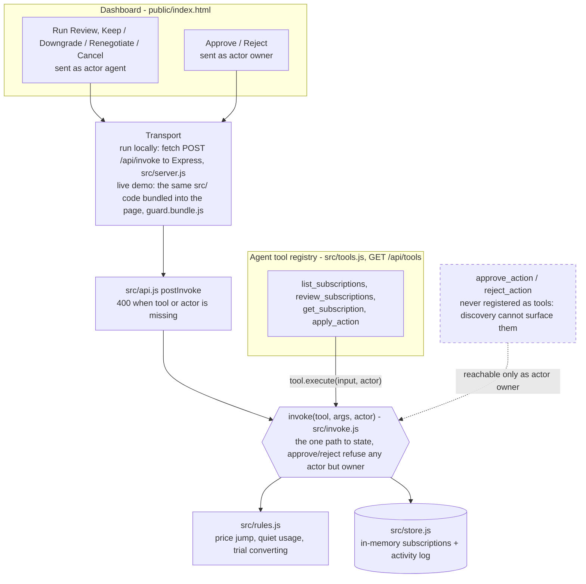

# Subscription/Renewal Guard

A price hike that lands quietly costs money, and a cancellation that fires on the wrong
subscription can cost a whole account. Subscription/Renewal Guard checks a household's or
small business's subscriptions for three warning signs: a price rise since the last
renewal, no usage for a long time, and a free trial about to become a paid plan. For each
subscription that trips a threshold, it drafts one action with the evidence behind it. The
draft is only a draft. `apply_action` can write a draft but never a `status`. Only
`approve_action` can change a subscription's real state, and it is
never registered as a tool an agent can call. It runs only from the owner's Approve click
on the dashboard.

**Try it live:** https://guptachetan1995.github.io/hack47-offgrid/ (runs entirely in your
browser on fictional data, nothing is sent anywhere, reload to reset)

**Demo video (2:10):** https://youtu.be/hkDpW_DNd00

**Source:** https://github.com/guptachetan1995/hack47-offgrid

Built for [HACK47: OFFGRID](https://hack47-offgrid.devpost.com/), which has an open brief:
no fixed theme and no required stack.

## What it does

`review_subscriptions` checks every subscription that is still `active` or on `trial`
against three rules (`src/rules.js`). Each rule has its own threshold, so the evidence in
a draft always traces back to one named rule:

| Rule | Fires when | Evidence it produces |
|---|---|---|
| Price jump | The latest price is more than 15% above the one before it | `Price rose 44% ($8.99→$12.99) at the 2026-09-02 renewal.` |
| Usage gone quiet | An `active` subscription has not been used in 60+ days | `No usage seen since 2026-06-02 (116 days).` |
| Trial converting | A `trial` converts to paid within 7 days | `Trial converts to paid on 2026-09-29 (3 days away).` |

For a flagged subscription, `apply_action` drafts one of four actions: **keep**,
**downgrade**, **renegotiate** or **cancel**. The draft's note must quote a number or date
that one of that subscription's fired rules actually produced, so a bare "cancel this" is
refused. Subscriptions that trip nothing get nothing back, so no work is invented for them.

Turning a draft into a real status is owner-only:

| Draft | Owner clicks Approve | Owner clicks Reject |
|---|---|---|
| `keep` | status → `active` | draft cleared, status unchanged |
| `downgrade` | status → `downgraded` | draft cleared, status unchanged |
| `renegotiate` | status → `renegotiation_sent` | draft cleared, status unchanged |
| `cancel` | status → `cancelled` | draft cleared, status unchanged |

After an approved downgrade, renegotiate or cancel, the subscription is no longer `active`
or `trial`, so review skips it and `apply_action` refuses to draft for it again.

The seed dates in `fake-data/seed-subscriptions.json` are stored as offsets from today, so
the demo stays correct whenever you run it. The dates in the evidence above come from a
run on 2026-09-26. Yours will be different.

## Architecture



- **One code path.** Every dashboard click and every agent tool call goes through the same
  `invoke(tool, args, actor)` in `src/invoke.js`, and every call is recorded in the activity
  log with the actor that made it, refusals included.
- **The gate is part of the structure.** `approve_action` and `reject_action` are left out
  of `src/tools.js`, so `GET /api/tools` lists four tools, and even a direct `invoke()` call
  to either one is refused unless `actor` is `owner`. `tests/approval-gate.test.js` and
  `tests/server-http.test.js` test both.
- **The live demo runs the same code.** `scripts/build-pages.js` uses esbuild to bundle
  `src/browser-entry.js` → `src/api.js` → `invoke`/`store`/`rules`/`tools` into
  `guard.bundle.js`. The dashboard calls that bundle in-page instead of `fetch`. Every
  response is JSON round-tripped the same way HTTP would do it.
  `tests/pages-build.test.js` runs the full demo story against the built bundle.

## Tools

Every agent tool description ends with the same sentence: *"Approve and Reject are
owner-only dashboard actions; no registered tool, including this one, can move a
subscription out of its drafted state."*

| Tool | What it does | What it does NOT do |
|---|---|---|
| `list_subscriptions` | Lists tracked subscriptions, optionally filtered by `status` | Change anything. It is read-only |
| `review_subscriptions` | Runs the three rules against every active/trial subscription and returns only those that trip at least one, with the evidence for each | Draft an action, change any subscription, or return anything for a subscription with nothing wrong |
| `get_subscription` | Returns the full record for one subscription: price history, last use, any current draft | Change anything. It is read-only |
| `apply_action` | Drafts one action (`keep`/`downgrade`/`renegotiate`/`cancel`) with a note citing the fired rule's evidence | Change `status` (a `status` field in its args is refused and logged). It also refuses a subscription that is no longer active/trial or has no fired rule, and a note that cites no real evidence |
| `approve_action` *(owner-only, not a tool)* | Writes the draft into `status` (see the table above) and clears the draft | Run for any actor but `owner`, show up in `GET /api/tools`, or approve a subscription with no draft |
| `reject_action` *(owner-only, not a tool)* | Clears the draft. The `reason` is recorded in that call's activity-log entry | Touch `status`, run for any actor but `owner`, or show up in `GET /api/tools` |

## Demo walkthrough

Works the same on the [live demo](https://guptachetan1995.github.io/hack47-offgrid/) and
with `npm start`:

1. The page loads five fictional subscriptions: StreamVault Plus, CloudBackup Pro,
   PixelCraft Design (trial), SonicStream and SafeVault Storage. None has a draft yet.
2. Click **Run Review**. Three of the five are flagged, each with its evidence line:
   StreamVault Plus (price jump, $8.99→$12.99), CloudBackup Pro (no usage for 116 days) and
   PixelCraft Design (trial converts in 3 days). SonicStream and SafeVault Storage get
   nothing.
3. Click **Renegotiate** on StreamVault Plus. A draft appears whose note quotes
   `$8.99→$12.99`, and the badge still reads Active. Click **Approve**. The badge changes
   to **Renegotiation sent** and the card's action buttons go away.
4. Click **Cancel** on CloudBackup Pro, then **Reject** on that draft. The draft is cleared
   and the badge stays **Active**. The evidence line comes back because the rule still
   fires. Only the suggestion was dismissed.
5. Under **Try it as the agent**, click **Agent: set status directly**. This is an
   `apply_action` call with `status: "cancelled"` added to its args. It is refused with
   `apply_action cannot set status directly — only approve_action can.`, and no status
   changes. Click **Agent: approve a draft**. It is refused with
   `approve_action is an owner-only action; no agent tool can approve a draft.`
6. The **Activity log** at the bottom lists every call above with its actor, refusals
   included.

## Run locally

Requires Node.js 20+ and npm. Output below is from a fresh clone with no `node_modules`,
captured 2026-09-26. Six `npm warn deprecated` lines from ESLint 8's dependency tree are
left out.

```
$ npm install
added 594 packages, and audited 595 packages in 2s

137 packages are looking for funding
  run `npm fund` for details

found 0 vulnerabilities

$ npm start

> hack47-offgrid-subscription-guard@0.1.0 start
> node src/server.js

Subscription/Renewal Guard listening on http://localhost:3100 (local only)
```

Open http://localhost:3100. Set `PORT` to use another port. The server binds to
`127.0.0.1` and refuses any connection that isn't loopback.

```
$ npm test

> hack47-offgrid-subscription-guard@0.1.0 test
> jest --passWithNoTests

PASS tests/pages-build.test.js
PASS tests/server-http.test.js
PASS tests/rules.test.js
PASS tests/invoke.test.js
PASS tests/approval-gate.test.js
PASS tests/api.test.js

Test Suites: 6 passed, 6 total
Tests:       59 passed, 59 total
Snapshots:   0 total
Time:        0.398 s, estimated 1 s
Ran all test suites.

$ npm run lint:check

> hack47-offgrid-subscription-guard@0.1.0 lint:check
> eslint src/ tests/ scripts/ --ext .js,.jsx

```

ESLint prints nothing when it finds 0 errors and 0 warnings.

`./verify.sh` runs everything in one step. It checks that `README.md` and the MIT
`LICENSE` are present, that this README contains no placeholders and still states the
approval gate, and then runs `npm test` and `npm run lint:check`. It exits non-zero on any
failure:

```
$ ./verify.sh
== entry root files ==
  ok: README.md
  ok: LICENSE
== LICENSE is MIT and visible ==
== no unresolved placeholders ==
== the structural human-approval gate is named, not just described ==
== Running tests ==

> hack47-offgrid-subscription-guard@0.1.0 test
> jest --passWithNoTests

PASS tests/rules.test.js
PASS tests/api.test.js
PASS tests/approval-gate.test.js
PASS tests/invoke.test.js
PASS tests/pages-build.test.js
PASS tests/server-http.test.js

Test Suites: 6 passed, 6 total
Tests:       59 passed, 59 total
Snapshots:   0 total
Time:        0.59 s
Ran all test suites.
== Running linter ==

> hack47-offgrid-subscription-guard@0.1.0 lint:check
> eslint src/ tests/ scripts/ --ext .js,.jsx

hack47-offgrid: all checks passed.
```

## Build the static live demo

```
$ npm run build:pages

> hack47-offgrid-subscription-guard@0.1.0 build:pages
> node scripts/build-pages.js

Static demo built in dist/pages (guard-build c6df3b91ee09)
```

`dist/pages/` holds `index.html` (the same dashboard page, with one `<script>` tag for the
bundle), `guard.bundle.js` (the `src/` domain code, not minified, so it can be read) and
an empty `.nojekyll`. To preview it, serve that folder with any static server, for example
`python3 -m http.server --directory dist/pages 8080`.

The live demo is that same build output pushed to this repo's `gh-pages` branch and served
by GitHub Pages. Deploying is a manual `git push` of the build output. There is no CI and no GitHub
Actions workflow. `dist/` is gitignored on `main`.

## What this does not do

- **No real billing provider and no payment method.** Nothing talks to a billing API,
  charges a card or sends a real cancellation. "Renegotiation sent" is a status value in an
  in-memory store.
- **No persistence.** State lives in memory. Restarting the server or reloading the live
  demo resets it to the seed.
- **Fictional data only.** All five subscriptions come from
  `fake-data/seed-subscriptions.json`.
- **No bundled language model.** The agent's side is the four-tool registry
  (`src/tools.js`, listed at `GET /api/tools`) that any tool-calling agent can drive. On the
  dashboard, Run Review and the draft buttons make the same calls with `actor: "agent"`.
- **No authentication.** `actor` is a field in the request. The owner/agent split is
  enforced at the chokepoint for a single local user, not across multiple accounts. That
  is why the server accepts loopback connections only.

## License

[MIT](./LICENSE)
